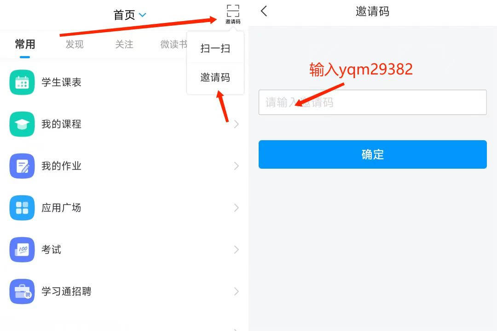
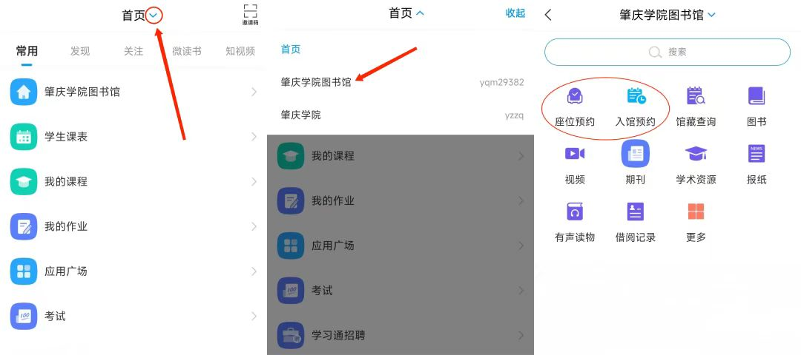
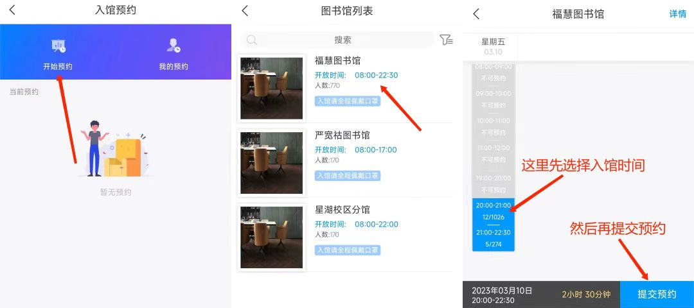
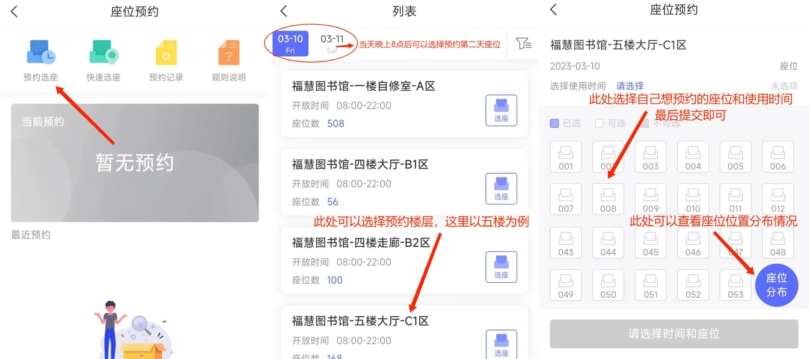

## 图书馆预约的操作流程

分享来源：[微信公众号-白乎乎](https://mp.weixin.qq.com/s/MQVSyp3A6qMifk9KWzX-Vg)

一、打开学习通，点击右上角邀请码按钮，然后点击邀请码并输入yqm29382。

   

或是首页->肇庆学院图书馆。

   

二、进行入馆预约和作为预约。

   

   

三、两者都预约完成后，便可前往图书馆。

   

